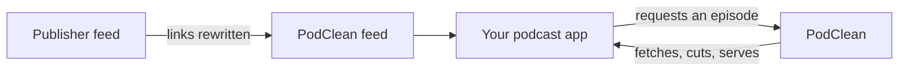
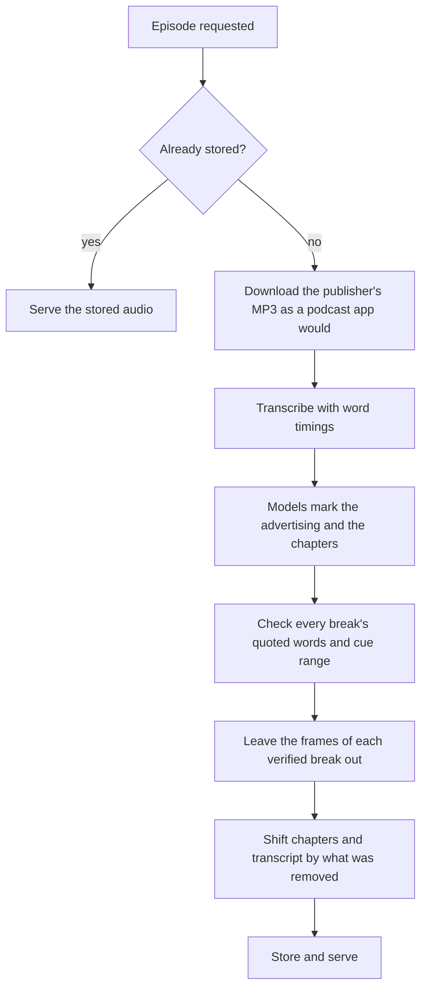

# PodClean

**Fewer podcast ads. The same show, in your usual podcast app.**

PodClean is a self-hosted service that removes advertising from podcast episodes.
Subscribe to a podcast through PodClean instead of through its publisher, and when your
app downloads an episode it gets the publisher's own audio with the advertising breaks
cut out. Titles, episode list, show notes and publication dates stay the same. Nothing is
re-encoded: what remains is the publisher's own MP3 frames. Chapter marks and a
transcript, timed to the audio it serves, come with every cut episode.



[Get started](#get-started) · [How it works](#how-it-works) · [Configuration and storage](#configuration-and-storage) · [Development](#development)

## What to expect

| | |
|---|---|
| **Subscribing** | One RSS URL per podcast, in any app that can subscribe by URL. |
| **First download** | PodClean downloads, transcribes and classifies the episode before sending it: a few minutes, rising with the episode's length. Your app waits. |
| **Later downloads** | Served from disk, byte-identical, no new API calls. |
| **Cost** | Transcription and classification through [OpenRouter](https://openrouter.ai): a few cents per episode, rising with length. Every episode is paid for once. |
| **Audio** | MP3 only. Whole frames are left out; nothing is re-encoded. |
| **Chapters and transcript** | Generated in the same pass, adjusted for the removed audio, and written into the MP3 as well. Whether your app shows them depends on the app. |

Episodes are processed **on demand**, when your app asks for them, not when the feed
refreshes. One episode is processed at a time; everything already stored keeps being
served meanwhile.

> **The programme is never cut.** Where it is not certain that a stretch is advertising, it
> stays. Expect some advertising to survive; expect no sentence of the show to go.
> [Why](#why-some-advertising-remains) and [how that is measured](#how-results-are-checked).

## Get started

You need Docker with Compose, an [OpenRouter](https://openrouter.ai) API key, and an
address your podcast app can reach. The server is a single Go binary: no database, no
ffmpeg. It is published as a Docker image for amd64 and arm64, so a Raspberry Pi will do.
Audio goes to the transcription API and the transcript to the classification models;
nothing else leaves the host.

### 1. Configure

Two files are all a deployment needs, no clone:

```sh
mkdir podclean && cd podclean
curl -fsSLO https://raw.githubusercontent.com/Valleeh/podcleaner/master/compose.yaml
curl -fsSL  https://raw.githubusercontent.com/Valleeh/podcleaner/master/.env.example -o .env
```

Fill in the two required values in `.env`:

```dotenv
PODCLEANER_BASE_URL=https://podclean.example.org
PODCLEANER_LLM_API_KEY=your-openrouter-api-key
```

`PODCLEANER_BASE_URL` is the address **your podcast app will use**. PodClean writes it
into every episode link, so it has to be reachable from your listening devices.

### 2. Start it

```sh
docker compose up -d
```

That pulls `ghcr.io/valleeh/podcleaner:latest` and publishes port `8080`. Put a reverse
proxy in front of it for HTTPS and access control — the episodes you produce are yours,
not the internet's, and PodClean has no authentication of its own — and let the proxy
keep a request open for the minutes a first download takes. With
[Caddy](https://caddyserver.com), for example:

```caddyfile
podclean.example.org {
	reverse_proxy localhost:8080
}
```

Caddy gets the certificate itself and has no upstream timeout by default, so a first
download is not cut off.

To update: `docker compose pull && docker compose up -d`. Stored episodes live in a volume
and survive it.

Without Compose, the same thing is one command:

```sh
docker run -d --name podclean --restart unless-stopped -p 8080:8080 \
  -e PODCLEANER_BASE_URL=https://podclean.example.org \
  -e PODCLEANER_LLM_API_KEY=your-openrouter-api-key \
  -v podclean-episodes:/var/lib/podclean \
  ghcr.io/valleeh/podcleaner:latest
```

To build the image from source instead, clone the repository and run
`docker compose up -d --build` in it.

### 3. Add a podcast

Take the publisher's feed URL, URL-encode it, and put it after `/rss?feed=`:

```text
Publisher feed:  https://example.com/podcast/feed.xml
Subscribe to:    https://podclean.example.org/rss?feed=https%3A%2F%2Fexample.com%2Fpodcast%2Ffeed.xml
```

Paste the second URL into your app's **Add by URL** (or equivalent). The app reads the
feed from PodClean and asks PodClean for the episodes; the first play of each one waits
for processing. Episodes the app already downloaded under the original subscription stay
as they are.

## How it works



1. **Fetch the audio as a podcast app would.** Publishers serve different copies to
   different clients; the podcatcher's copy is the one with the ads. The bytes must parse
   as MP3 frames, or the reply is not an episode, whatever it calls itself.
2. **Transcribe.** Large files go up in pieces split on frame boundaries, and the pieces
   are joined back onto one timeline.
3. **Mark the advertising and the chapters.** By default a cheap screening model reads the
   transcript first and a stronger verifier reads it with those findings; only the
   verifier's answer counts. Both come from one reading, so the chapter marks know where
   the breaks are.
4. **Check every break.** The model names the break's first and last cues and quotes its
   first words. The words must be found, once, inside the cues it named; the cut starts on
   that word and ends where the last named cue ends. A break whose words cannot be found,
   whose cue numbers do not exist, or that the model is not confident about is left in. A
   plan that is not believable as a whole — one break over 10 minutes, or breaks adding up
   to more than a fifth of the episode — is thrown away entire.
5. **Cut and publish.** The frames inside each verified break are left out. Chapter marks
   and transcript lines move earlier by exactly the audio removed before them; anything
   inside a cut is dropped rather than moved to the join. The marks are also written into
   the MP3, because some apps read those and ignore the feed's link.

### Why some advertising remains

**No second of programme is ever removed.** A missed advertisement is an annoyance; a
sentence that disappears cannot be recovered, and the listener cannot even tell it is
gone. Every trade-off resolves that way.

So a cut begins 1.5 s after the break's first word and ends 1.5 s before the break's last
cue ends. The margin is where an error of a word lands — a quote one word early, a
timestamp a beat late, a cue that runs a breath past the advertisement — and it is spent
on leaving advertising in:

```text
                 break as the model reported it
                 |<---------------------------------->|
before:   SHOW   | 1.5 s |        ADVERTISING         | 1.5 s |   SHOW
after:    SHOW   | 1.5 s |                            | 1.5 s |   SHOW
```

*Illustration; actual cuts land on MP3 frame edges, 26 ms apart.*

Only paid reads, host endorsements and trailers for other shows are cut. The show's own
promotion — its live dates, its other podcast, its outro — and the credits stay in. Whole
breaks are sometimes missed. On the episodes measured, between a third and a half of the
advertising survives.

Smaller things a listener notices:

* The join may fall in the middle of a word; what is on both sides of it is advertising.
* A transcript line that overlapped a cut is dropped whole, so a few seconds either side
  of each join have audio and no text.
* Chapter titles are the model's own and can be wrong about what a passage is called; the
  times are arithmetic. Where a mark fell inside a cut, the stretch after the join carries
  the previous chapter's title.
* A cut episode carries no cover art. An episode served whole keeps the publisher's file
  as it was.

### When no cut is made

| Situation | What the listener gets | Then |
|---|---|---|
| No eligible advertising, or every break refused | The publisher's audio, whole | Stored and served from disk from then on. |
| Episode longer than 2 h 20 min | The publisher's audio, whole, unexamined | Stored; no chapters or transcript are ever generated for it. |
| Transcription or classification fails | The publisher's audio, whole | Nothing is kept; the next request does the work — and pays — again. |
| Publisher download fails, or is not MP3 | An HTTP 502 | Nothing is kept; the next request tries the publisher again. |

## Configuration and storage

Compose reads these from `.env`:

| Variable | Purpose | Default |
|---|---|---|
| `PODCLEANER_BASE_URL` | Reachable address written into feed links | required |
| `PODCLEANER_LLM_API_KEY` | OpenRouter key, for transcription and classification | required |
| `PODCLEANER_PORT` | Published host port | `8080` |
| `PODCLEANER_LLM_SPEC` | Classification model or cascade | `cascade:qwen/qwen3.7-flash>deepseek/deepseek-v4-flash` |

A cascade is `cascade:screening-model>verifier-model`; a bare model id is one pass. The
server's full configuration is in [the contract](docs/contract.md).

Episodes live in the `episodes` volume at `/var/lib/podclean`, one directory each:

```text
<episode-key>/
├── source.json       the publisher's audio URL and feed
├── audio.mp3         what is served
├── chapters.json     chapter marks on the served timeline
├── transcript.vtt    transcript on the served timeline
└── verdict.json      what was decided, and the removed intervals
```

Not every outcome writes every file: a failed run stores no audio, an episode too long to
examine gets no chapters or transcript. Every episode a fetched feed has named gets a
directory; a produced one is roughly the size of the original, and nothing deletes them.
An episode once produced is never revisited — an improvement made later does not reach
it. To have one produced again, delete its `audio.mp3`; the next request runs processing
again.

## HTTP endpoints

You only ever paste the RSS URL; the feed carries the other links.

| Endpoint | Returns |
|---|---|
| `/rss?feed=…` | The publisher's feed, byte for byte, with each episode's audio link — and its chapter and transcript links, where the feed declares the podcast namespace — pointing here. |
| `/podcast?feed=…&guid=…` | The episode's MP3; produces it on the first request. `HEAD` and single byte ranges are answered. |
| `/chapters?feed=…&guid=…` | Chapter marks as JSON. |
| `/transcript?feed=…&guid=…` | Transcript as WebVTT. |

Parameter values are URL-encoded; `guid` is the episode identifier from the feed. An
episode can only be requested after it has appeared in a feed fetched through `/rss`.
Chapters and transcript never start processing: they answer 404 until their file exists.

## How results are checked

Publishers who stitch advertising in serve the ad-free master to a plain HTTP client and
the stitched copy to a podcatcher, and the stitched copy reuses the master's frames byte
for byte. `./run verify` fetches both, walks them against each other to recover every
inserted break exactly, and checks the intervals PodClean removed against them. It shares
no code with the part that does the cutting.

```
$ ./run verify https://feeds.lagedernation.org/feeds/ldn-mp3.xml 91b5c148-…

advertising in the file the listener would have got: 191.664 s in 3 break(s)
  1  01:09.84 - 02:12.01  ( 62.172 s)   removed   0.000 s
  2  24:25.74 - 25:57.18  ( 91.440 s)   removed  67.300 s
  3  75:24.26 - 76:02.32  ( 38.052 s)   removed  23.660 s

PROGRAMME INTACT   every removed interval lies inside a true ad
ADVERTISING        90.960 s of 191.664 s removed (47.5%), 100.704 s still plays
```

It is a result for one downloaded copy: stitched advertising changes between downloads,
so the seconds move between runs and the last line is what matters. If the publisher has
re-stitched the episode since it was cut, the tool refuses to answer rather than compare
against different bytes; if the publisher serves the same audio to both clients, there is
nothing to measure and it says so. It reads the episode's directory from `var/episodes`,
or from `PODCLEANER_STORE_ROOT` — point that at a copy or mount of the compose volume.

## Development

The server is Go; the suite and the tools are Python 3.11+. The suite starts the real
binary and speaks to it over HTTP, with a local stub standing in for the publisher and
the two paid APIs, so it needs no API key. It builds its own 73-minute episode and
measures what comes back with an ffmpeg that shares no code with the server — the only
thing to build besides the server itself:

```sh
python3 -m venv .venv && .venv/bin/pip install -e '.[test]'

docker build -t podclean-ffmpeg:ci - <<'DOCKERFILE'
FROM debian:12-slim
RUN apt-get update \
    && apt-get install -y --no-install-recommends ffmpeg \
    && rm -rf /var/lib/apt/lists/*
DOCKERFILE

./run build
./run test
```

That is what [CI](.github/workflows/test.yml) runs on every pull request. The other
commands:

```text
./run serve                     the server, in the image ./run build made, on the host's network
./run health [feed url]         is a ./run serve deployment working
./run verify <feed> <guid>      was a cut right (above)
./run save                      green suite, then stage everything
```

`./run serve` takes its configuration from exported `PODCLEANER_*` variables, not from
`.env`, and stores episodes under `var/episodes`. `PODCLEAN_SERVER_CMD=…` points the suite
at a server in any other language; the suite knows the server only as a process on a
port.

## Further reading

| Document | For |
|---|---|
| [docs/requirements.md](docs/requirements.md) | The promises above with every number taken out, numbered, each naming the test that asserts it. |
| [docs/contract.md](docs/contract.md) | What a re-implementation has to match: models, endpoints, the words sent to them, what is written on disk, the constants that carry a policy. |

## License

[MIT](LICENSE).
