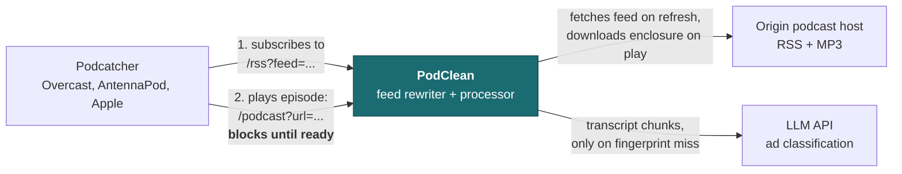
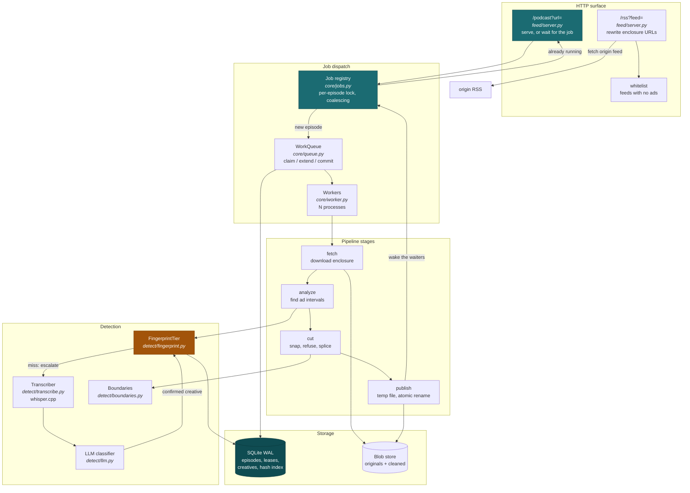
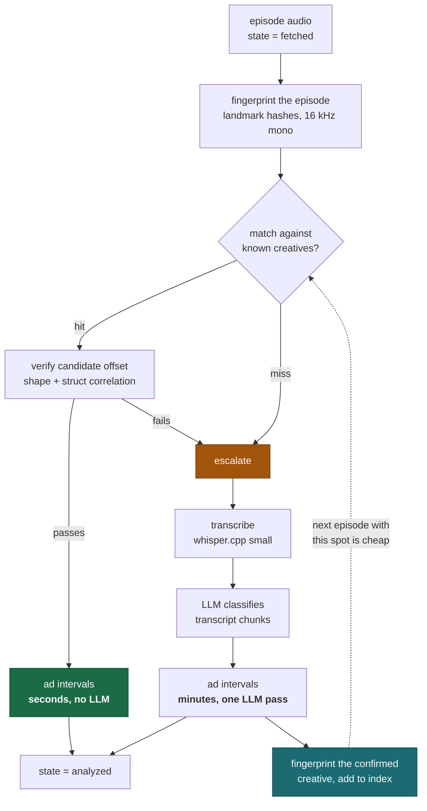
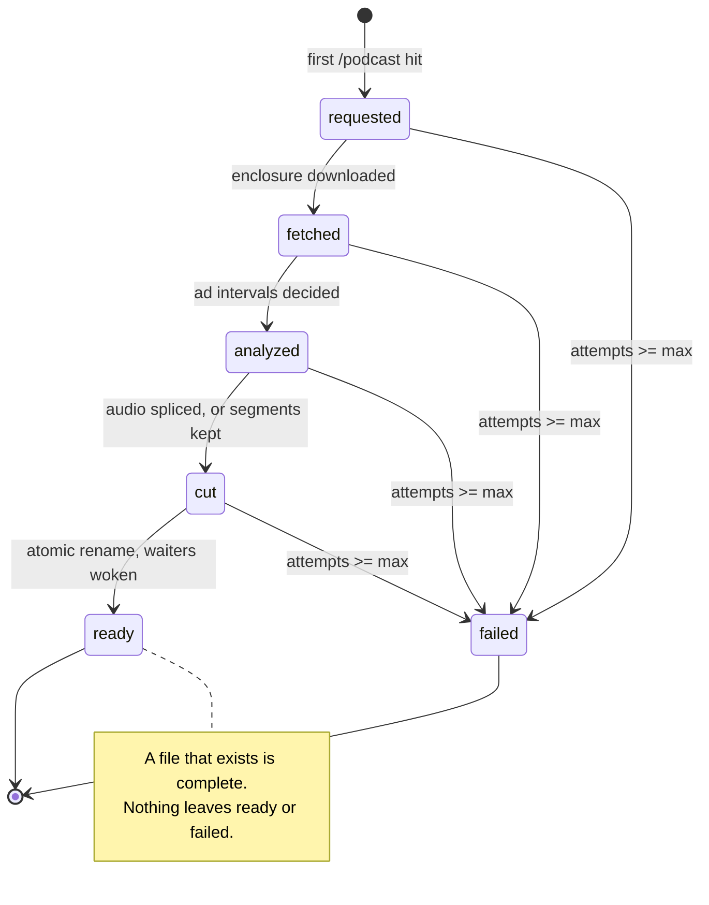
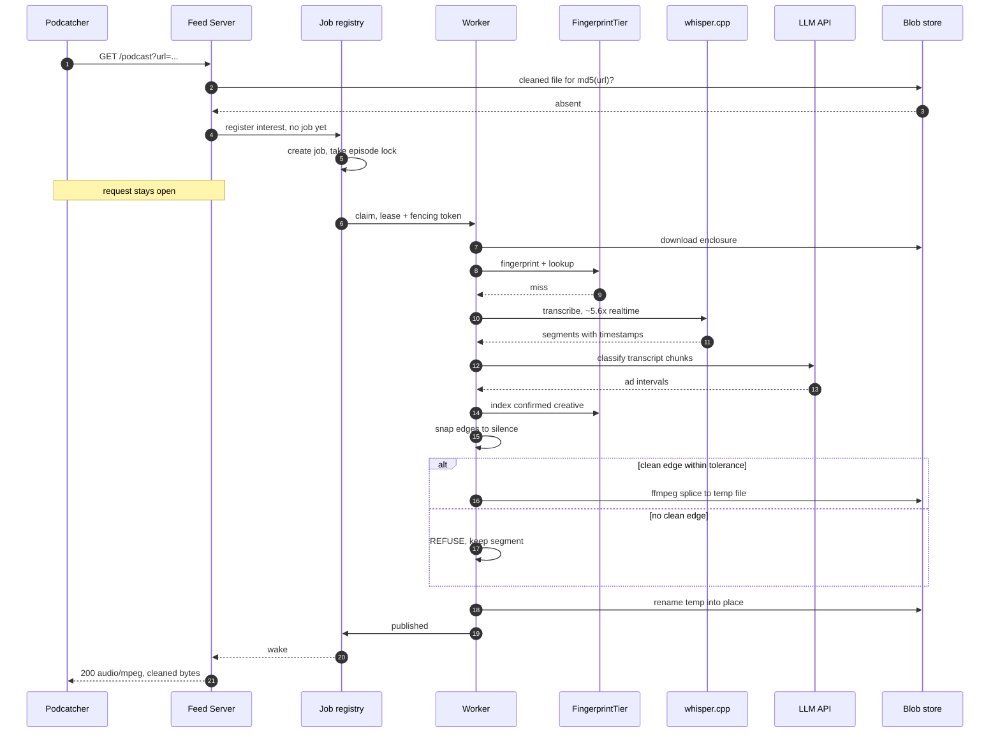
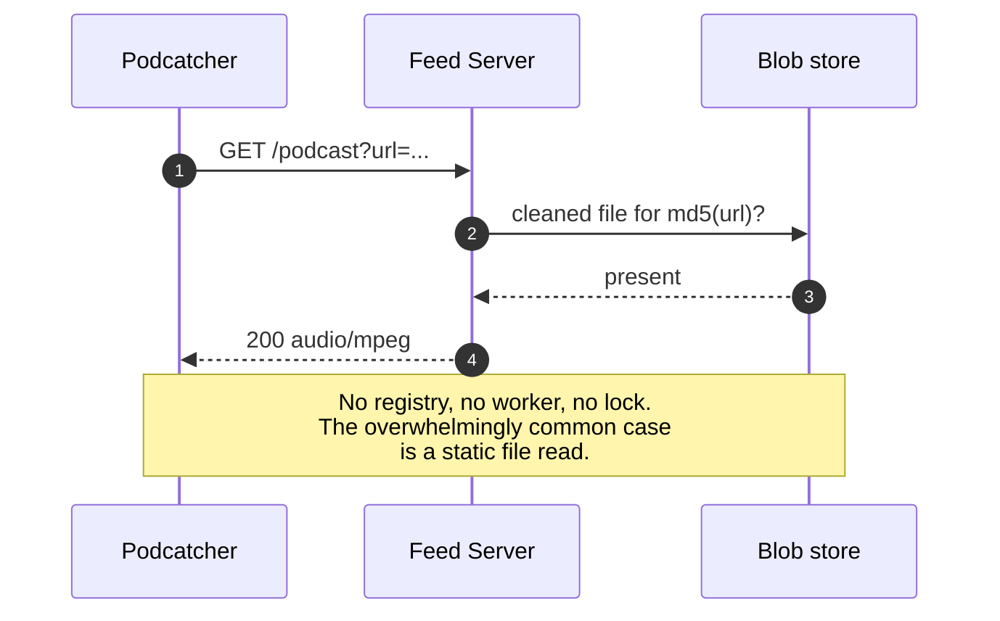
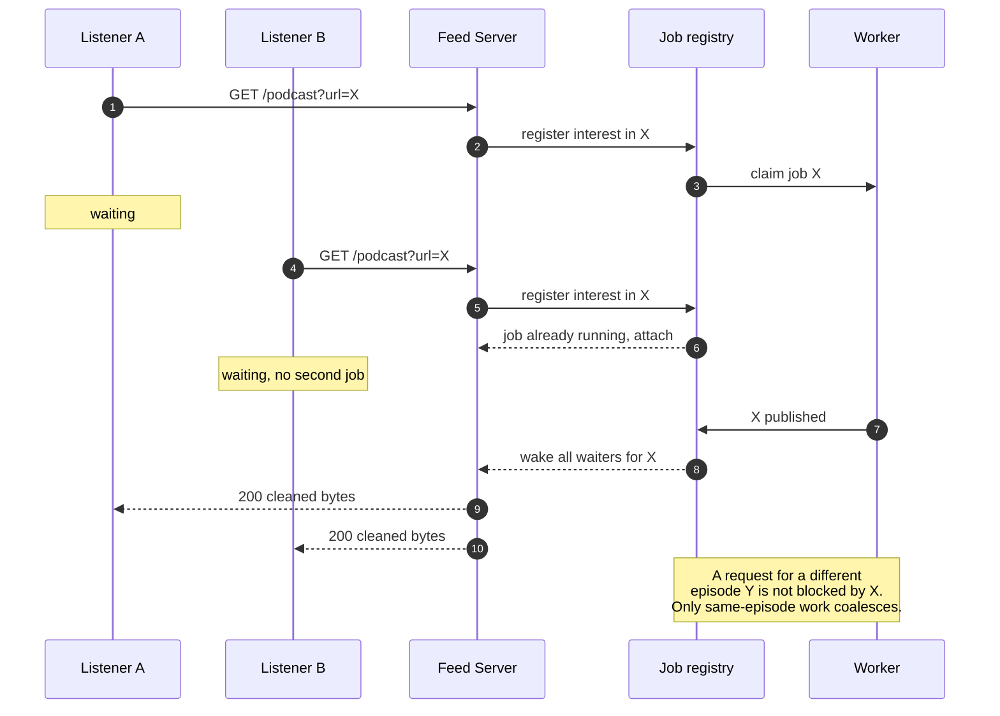
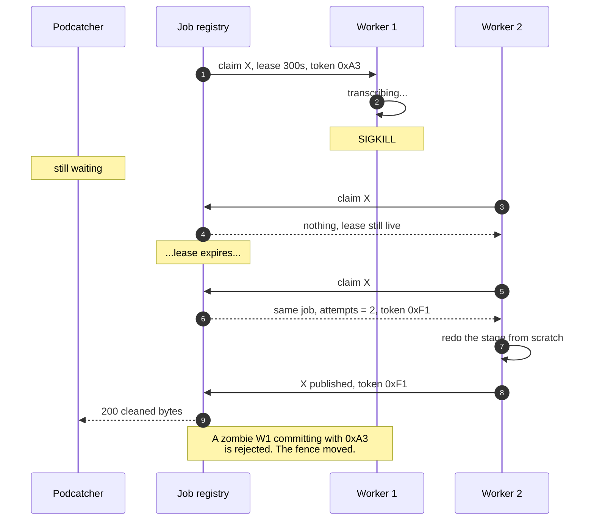
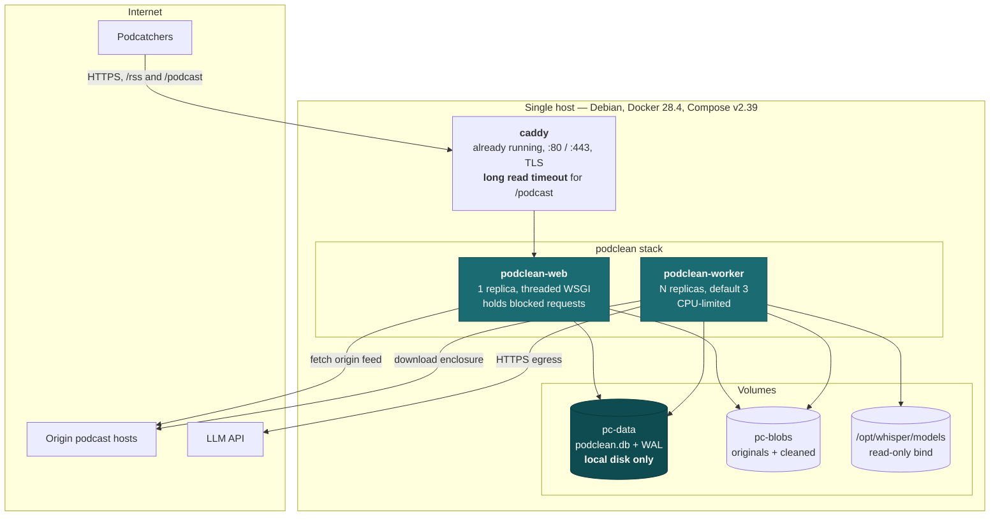
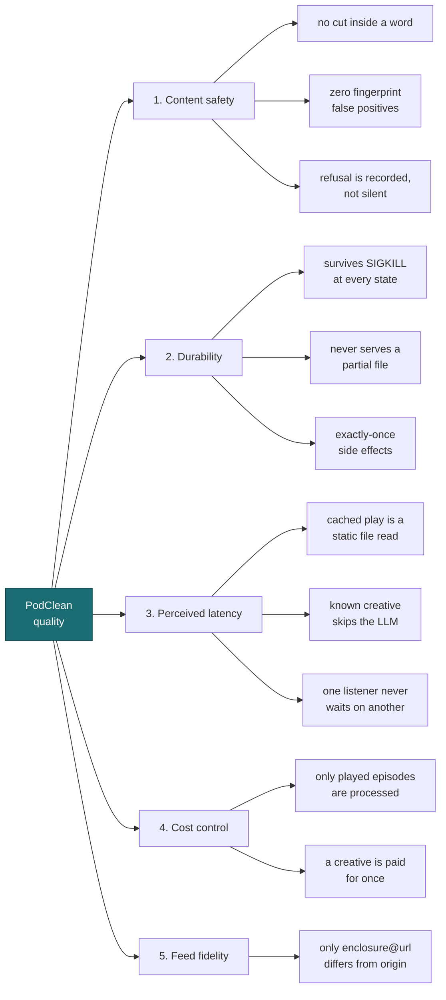

# PodClean v2 — Architecture (arc42)

Status: design, 2026-09-05.
Supersedes the five-service MQTT pipeline in `services/`, which is archived rather than
deleted. Keeps the trigger model of the existing working implementation.

---

## 1. Introduction and Goals

PodClean removes advertising from podcast episodes without the listener changing anything
about how they listen. It stands between a podcatcher and the origin host: it serves a
rewritten copy of the origin RSS feed in which every episode's audio URL points back at
PodClean, and it produces the ad-free audio on demand when that URL is played.

### 1.1 Quality goals

Ordered. Where two conflict, the higher one wins — this ordering is the single most
load-bearing thing in the document.

| # | Goal | What it means concretely |
|---|---|---|
| 1 | **Content safety** | Never remove real content. A missed advertisement is an annoyance; a sentence clipped mid-word is destructive and the listener cannot recover it. Errors are not symmetric and the system must not treat them as if they were. |
| 2 | **Durability** | A crash never produces a truncated file that is then served as complete, and never loses an episode. Any interrupted work can simply be redone. |
| 3 | **Perceived latency** | The listener holds an open connection while the episode is produced. Time-to-clean-file is therefore a user-facing quality, not a background concern. |
| 4 | **Cost control** | LLM spend is bounded and proportional to what is actually listened to, not to what is published. |
| 5 | **Feed fidelity** | The rewritten feed is indistinguishable from the origin except for the enclosure URLs. A podcatcher must not be able to tell the difference in any other respect. |

### 1.2 Stakeholders

| Role | Expectation |
|---|---|
| Listener | Subscribes in a normal podcatcher, presses play, hears no ads. Never configures anything per episode. |
| Operator (the repo owner) | Runs it on one small box, wants a bounded and predictable LLM bill, and wants to fix things without redeploying five services. |
| Podcatcher app | Not a person, but it constrains the design: it follows enclosure URLs mechanically and enforces its own request timeouts. It cannot be changed or negotiated with. |
| Origin podcast host | Must not be hammered. Its feed is fetched on refresh and its audio downloaded once per episode. |

---

## 2. Architecture Constraints

| Constraint | Consequence |
|---|---|
| One host: Debian, Docker 28.4, Compose v2.39 | No distributed queue. SQLite is viable precisely because everything shares a kernel and a filesystem. |
| Caddy already owns `:80` and `:443` on the box | PodClean takes a subdomain behind it, and inherits Caddy's timeout behaviour as a design concern. |
| CPU only — AMD Ryzen R1505G, no GPU | whisper small measured ~5.6× realtime. Transcription dominates every cold episode. |
| SQLite with WAL must be on local disk | Rules out network volumes. Pins the stack to one host until the queue is replaced. |
| Python 3.12, moving to 3.13 | `audioop` is removed in 3.13, so pydub is not an option. All audio work is ffmpeg subprocesses. |
| `whisper-cpp:local` already built on the host | whisper.cpp v1.9.3, native for this CPU. Reused as a build stage rather than rebuilt or containerised again. |
| LLM API bills roughly $0.04 per episode | Makes pre-production of whole feeds economically wrong, and makes caching of ad creatives economically decisive. |
| Podcatchers cannot be modified | The only two interfaces the system has are an RSS feed and an audio URL. |

---

## 3. Context and Scope

### 3.1 Business context



| Partner | In | Out |
|---|---|---|
| Podcatcher | Feed subscription request; episode play request | Rewritten RSS; cleaned MP3 bytes |
| Origin host | — | Original RSS; original MP3 |
| LLM API | Transcript chunks | Ad interval markings |

There is no arrow into the origin host that a listener did not cause. Every byte of work
traces back to somebody pressing play.

### 3.2 Technical context

| Interface | Protocol | Notes |
|---|---|---|
| `GET /rss?feed=<url>` | HTTPS, `application/rss+xml` | Fetches origin feed, rewrites `enclosure@url` in place, applies whitelist |
| `GET /podcast?url=<mp3>&rss=<md5>` | HTTPS, `audio/mpeg` | The trigger. Serves the cleaned file, blocking until it exists |
| Origin feed fetch | HTTPS | On podcatcher refresh only |
| Enclosure download | HTTPS | Once per episode |
| LLM API | HTTPS, JSON | Only on fingerprint miss |

---

## 4. Solution Strategy

Keep the working version's shape; replace what is behind it.

| Quality goal | Approach |
|---|---|
| Content safety | Snap every cut edge to a detected silence, and **refuse to cut** when no clean edge is within tolerance. Two-stage fingerprint verification so the cheap tier can never assert an ad on weak evidence. |
| Durability | SQLite state machine with leases and fencing tokens; the stage's side effect is made durable *before* the transition commits; publication is a `rename()`, so a file that exists is complete. |
| Perceived latency | Fingerprint known ad creatives before transcribing. A per-episode lock instead of a global mutex, so one listener's wait never becomes another's. |
| Cost control | On-demand processing (nothing produced that nobody plays) plus a creative index, so a spot is paid for once rather than once per episode. |
| Feed fidelity | Edit the origin XML in place with lxml; never rebuild the document. Only `enclosure@url` is touched. |

The engine for most of this already exists — `core/` (SQLite state, leases, fencing),
`detect/` (fingerprint tier, boundary snapping, refusal rule) and `eval/` (asymmetric
scorer, synthetic corpus). v2 is that engine behind PodClean's interface.

---

## 5. Building Block View

### 5.1 Level 1 — PodClean as a whitebox



**Contained building blocks**

| Block | Responsibility | Deliberately not its job |
|---|---|---|
| `/rss` endpoint | Fetch origin feed, rewrite enclosure URLs, apply whitelist | Triggering any processing |
| `/podcast` endpoint | Serve a ready file, or register interest and wait | Doing the work |
| Job registry | One job per episode; coalesce concurrent waiters; wake them on publish | Knowing what a stage does |
| WorkQueue | Hand a job to exactly one worker; expire dead leases | Ordering policy |
| Worker | Claim, dispatch by state, commit after success | Stage logic |
| Stage handlers | One transition each, idempotent | Scheduling, retry policy |
| FingerprintTier | Answer "have I heard this audio before"; escalate on miss | Deciding what counts as an ad |
| Transcriber | Audio to timestamped segments | Interpreting them |
| LLM classifier | Mark ad spans in a transcript | Turning spans into cuts |
| Boundaries | Turn approximate intervals into safe cuts, or refuse | Finding ads |
| Blob store | Hold originals and cleaned artifacts | Knowing episode state |

The block that does not exist in the working version is the **job registry**. It is what
turns one global mutex into a per-episode one, and it is the thing a blocked request waits
on.

### 5.2 Level 2 — the analyze stage



Candidate offsets come from a histogram of `query_frame − reference_frame`: a real
occurrence puts every one of its votes into a single bin, chance collisions smear across
all bins. Each candidate is then verified against the mel spectra directly — `shape` (mean
per-frame cosine of L2-normalised mel energies, gain-invariant by construction) and
`struct` (Pearson correlation of the mean-removed log-mel matrices, which strips the
stationary envelope and leaves only this waveform's temporal fine structure).

Two stages, because a false positive here causes a bad cut, which quality goal 1 ranks as
the worst outcome the system can produce.

---

## 6. Runtime View

### 6.1 Episode lifecycle



Transitions are declared as data in `core/states.py`, not scattered through `if` statements,
so the full matrix can be enumerated and tested exhaustively. That module currently names
the entry state `discovered`, which described a scheduler finding a GUID; under the pull
model it is `requested`, and the rename is part of this change.

### 6.2 First play, cold creative

The listener is on the other end of this the whole time.



The rename is the commit. Before it there is no servable file; after it there is a complete
one. There is no window in which a partial file can be served.

### 6.3 Second play — the cached path



### 6.4 Two listeners, one episode

What the global mutex gets wrong today, and what the registry fixes.



### 6.5 Worker dies while a listener waits



Because the transition never committed and the rename never happened, there is no
half-finished artifact to reconcile. The stage runs again, and the listener — who never
knew — still receives a complete file.

---

## 7. Deployment View



### 7.1 Mapping

| Node | Building blocks | Notes |
|---|---|---|
| `podclean-web` | `/rss`, `/podcast`, job registry | Threaded WSGI. Blocked requests are idle but each occupies a slot for minutes |
| `podclean-worker` | WorkQueue consumer, all stage handlers, detection | N replicas, CPU-limited so transcription cannot starve cached reads |
| `pc-data` | SQLite + WAL | Local disk only |
| `pc-blobs` | Originals and cleaned artifacts | |
| `caddy` | — | Pre-existing; TLS termination and reverse proxy |

### 7.2 One image, two commands

```
FROM python:3.12-slim
  apt: ffmpeg
  COPY --from=whisper-cpp:local  /usr/local/bin/whisper-cli  /usr/local/bin/
  COPY --from=whisper-cpp:local  /usr/local/lib/*.so*        /usr/local/lib/
  pip install -e .

# web / work are the same image with a different argv
```

Using the existing `whisper-cpp:local` as a build stage means no docker-in-docker and no
second ffmpeg installation; the worker calls `whisper-cli` as a plain subprocess.

---

## 8. Cross-cutting Concepts

### 8.1 Domain model

| Concept | Meaning |
|---|---|
| **Episode** | One enclosure URL. Identity is `md5(mp3_url)` — see the caveat in §11. |
| **Ad interval** | `[start, end]` in seconds, half-open in spirit. Never silently repaired; invalid input raises. |
| **Creative** | A specific advertisement recording, identified by its fingerprint rather than by its text. The same spot across episodes is one creative. |
| **Cut plan** | The set of intervals actually cut, each carrying the snap decision, the reason and the numbers behind it. |
| **Lease** | A time-bounded claim on an episode by one worker, carrying a random fencing token. |

### 8.2 Persistence and concurrency

SQLite in WAL mode: many readers alongside one writer, which is what makes a worker pool
viable in one file. `synchronous=FULL` — slower than `NORMAL`, but it is the honest setting
behind a durability claim. Every write uses `BEGIN IMMEDIATE`, taking the write lock up
front, because a deferred transaction that starts as a reader and upgrades can hit
`SQLITE_BUSY` without the busy handler being consulted — the usual source of spurious
"database is locked" errors. One connection per thread; no ORM, no connection pool.

Mutual exclusion has two layers with different jobs: the **job registry** ensures one job
per episode and lets many HTTP requests wait on it; the **lease** ensures one *worker* owns
that job at a time and that a dead worker's claim expires.

### 8.3 Idempotency and atomicity

Every stage is safe to run twice. The side effect is made durable before the state
transition commits — never the other way around, which is the classic bug that makes crash
recovery a fiction. Publication is `write to temp` then `rename()`, so existence implies
completeness and the cache check stays a simple `os.path.exists`.

### 8.4 Audio processing

ffmpeg subprocesses only. pydub is not used: it depends on `audioop`, removed in Python
3.13. Cut arithmetic is verified in tests with **ffprobe**, which shares no code with the
cutter — verifying our own cut math with our own cut code would be circular.

### 8.5 Error handling

A stage that raises leaves the episode in its previous state with `attempts` incremented.
At `max_attempts` the episode moves to `failed` and is not retried forever. A waiting
request on a failed episode gets an error, not a hang.

### 8.6 Logging

structlog via `logging.py`. Events are snake_case names with keyword fields —
`logger.info("cut_refused", episode=guid, edge=t, reason="no_silence_within_tolerance")` —
never formatted sentences. Every refusal is logged with its numbers, because a silent
fallback is indistinguishable from having no policy.

### 8.7 Configuration

One file, one schema, one loader, with `${VAR:-default}` substitution resolved before YAML
parsing. Anything the loader does not read does not appear in the file. The whitelist stays
a plain text file — it is edited by a human and that is the right interface — but a missing
whitelist must mean an empty whitelist, not HTTP 500.

### 8.8 Security

There is currently no authentication: possession of the PodClean URL is the only credential,
and `/podcast?url=` will process any URL handed to it. That is acceptable on a private box
and unacceptable the moment it is reachable from the open internet, because an unauthenticated
caller can drive LLM spend. See §11.

### 8.9 Verification strategy

Tests passing is not evidence, because code and tests can be wrong for the same reason.
Three things are evidence:

1. **Ground truth by construction** — splice a known clip at a known offset, so the answer
   is known because we built the input.
2. **Negative controls** — every criterion has a case that must fail, refuse, or return
   nothing. A detector that says yes to everything passes a positive-only suite.
3. **Mutation testing** — inject a specific bug, re-run; if the suite still passes, the
   suite is worthless. This is the primary anti-circularity check.

No network in tests. Nothing is downloaded. `corpus/real/` ships empty.

---

## 9. Architecture Decisions

### ADR-1 — Processing is triggered by the play request, not scheduled

*Context.* A feed has hundreds of episodes; a listener plays a handful. Each LLM pass costs
roughly $0.04.
*Decision.* Nothing is processed until somebody requests its audio.
*Consequences.* Spend tracks listening, not publishing. There is no scheduler and no
discovery. The cost is that a first play is slow — accepted in ADR-2.

### ADR-2 — The first request blocks until the clean file exists

*Context.* Producing a cold episode takes minutes. The listener has to get *something*.
*Decision.* Hold the request open. Do not redirect to the original.
*Consequences.* The first play is already ad-free, which is the product's promise. The risk
moves to podcatcher and proxy timeouts, which becomes a deployment constraint (§7) and a
risk (§11). Alternatives considered: 302 to the origin and process in the background, or a
bounded wait then redirect. Both were rejected in favour of never serving an ad-supported
file.

### ADR-3 — Lock per episode, not one global mutex

*Context.* The working version takes one process-wide mutex around the whole pipeline.
*Decision.* A job registry keyed by episode. Concurrent requests for the same episode attach
to the running job; different episodes proceed in parallel.
*Consequences.* One listener's wait stops becoming another's. Requires tracking waiters and
waking them on publish.

### ADR-4 — Work happens in a worker; the request waits on it

*Context.* Today the work runs inside the request, so a disconnect or timeout destroys it.
*Decision.* The request registers interest and waits; a worker owns the job.
*Consequences.* Client behaviour no longer determines whether work survives. Enables leases,
retries and crash recovery. Costs a process boundary and the state to coordinate across it.

### ADR-5 — Publish by atomic rename

*Context.* `remove_ads` writes directly to the final path, so a crash mid-write leaves a
truncated file that is served forever, because existence is the cache check.
*Decision.* Write to a temp path, `rename()` into place.
*Consequences.* Existence implies completeness. The cache check stays trivial.

### ADR-6 — SQLite is the queue and the state store

*Context.* v1 used MQTT with orchestration in the web server's callbacks and state in a JSON
file. Both crash badly.
*Decision.* One SQLite database in WAL mode holds episodes, leases, creatives and the hash
index. The queue is the orchestrator.
*Consequences.* Crash-safe and simple to reason about. Pins deployment to one host (§11).

### ADR-7 — Fingerprint before transcribing

*Context.* The same 30-second spot recurs across dozens of episodes and is currently
re-analysed every time.
*Decision.* Landmark-hash the episode and look it up against known creatives first;
escalate to transcription and LLM only on a miss, then index the confirmed creative.
*Consequences.* Under ADR-2 this is the difference between a wait of seconds and one of
minutes, as well as the main cost lever. Requires the false-positive rate to be held at
zero, hence two-stage verification.

### ADR-8 — Refuse to cut rather than cut badly

*Context.* Detector edges are approximate; cutting on them clips speech.
*Decision.* Snap each edge to a detected silence. If no clean edge is within tolerance,
**keep** the segment and record the refusal with its numbers.
*Consequences.* Some advertising survives. That is the correct trade under quality goal 1.
Explicitly not a silent fallback to "cut anyway", which from the outside is indistinguishable
from having no policy.

### ADR-9 — ffmpeg only, no pydub

*Context.* pydub depends on `audioop`, removed in Python 3.13.
*Decision.* All audio work is ffmpeg subprocesses; ffprobe is the independent oracle in tests.
*Consequences.* One external dependency, already present in the whisper image.

### ADR-10 — One image, two commands

*Context.* v1 built five images from four near-identical Dockerfiles and drifted.
*Decision.* One image; `web` and `work` differ only by argv. whisper-cli is copied from the
existing `whisper-cpp:local` build stage.
*Consequences.* One thing to build and version. No docker-in-docker.

---

## 10. Quality Requirements

### 10.1 Quality tree



### 10.2 Evaluation scenarios

Each is a test that either passes or does not. None is a judgement call.

| # | Scenario | Required response |
|---|---|---|
| Q1.1 | Synthetic audio with silence at a known instant; a detector edge nearby | Snapped boundary lands within tolerance of the known silence |
| Q1.2 | No silence within tolerance of a proposed edge | The segment is **kept**; the refusal survives to the output file |
| Q1.3 | Word-timestamp fixture | No cut boundary falls strictly inside a word |
| Q1.4 | 20 content files containing no advertisement | **Zero** fingerprint matches |
| Q2.1 | A real subprocess is `SIGKILL`ed at each state in turn | After restart the episode still reaches `ready`; the waiting request receives a complete file |
| Q2.2 | 8 concurrent workers, 50 episodes | Each episode's side effect recorded exactly once; no `database is locked` |
| Q2.3 | Lease held, second worker claims | Zero claims while live; exactly one after expiry |
| Q2.4 | Crash between splice and rename | No file exists; next attempt redoes the stage |
| Q3.1 | Second play of a processed episode | Served without touching registry, worker or lock |
| Q3.2 | Known creative in a new episode | Analyze completes with the LLM invoked **exactly 0 times** |
| Q3.3 | Two listeners request different episodes simultaneously | Neither waits on the other |
| Q4.1 | A feed with 135 items, 3 played | 3 episodes processed, 132 untouched |
| Q5.1 | Structural diff of source and rewritten feed | The only differing nodes are `enclosure@url` |
| Q5.2 | Feed where zero episodes are processed | Still valid RSS, still lists every item |
| Q5.3 | Malformed origin feed | Clear error, no partial write, no crash |

---

## 11. Risks and Technical Debt

| Risk | Impact | Mitigation / status |
|---|---|---|
| **Proxy or podcatcher timeout during a blocked request** | The listener sees a failure while work continues invisibly. Most likely way this deployment breaks. | Raise Caddy's timeout deliberately (§7). The podcatcher's own timeout cannot be controlled — this is the accepted cost of ADR-2. |
| **Cache key is `md5(mp3_url)`** | Many podcast CDNs append per-request tracking or session parameters. If the URL varies between refreshes, the key changes, the cache misses, and the episode is processed and paid for again. | Not yet addressed. Normalising the URL, or keying on the feed GUID instead, needs a decision before this bites. |
| **No authentication on `/rss` or `/podcast`** | An unauthenticated caller can drive arbitrary LLM spend. | Acceptable on a private box; blocking for any internet-facing deployment. |
| **Cold-episode wait is long** | ~8 hours of CPU for a 90-minute episode on a genuinely new advertisement. | Fingerprint tier removes it for repeat creatives, which is the common case in a subscribed feed. Nothing removes it for the first encounter. |
| **SQLite pins the stack to one host** | No horizontal scaling. | Accepted (ADR-6). Multi-host means replacing the queue, and that is the migration to plan if it ever comes. |
| **Real-world detection accuracy is unmeasured** | We do not know how often the LLM tier is right on real podcasts. | `corpus/real/` ships empty by design; measuring it is human work. No number should be quoted until somebody has listened. |
| **Known defects carried from the working version** | `f.write(etree.tostring(root))` writes bytes to a text-mode file and raises; a missing `whitelist.txt` returns HTTP 500. | Both fixed as part of the port. |

---

## 12. Glossary

| Term | Meaning |
|---|---|
| **Coalescing** | Attaching several waiting requests to one running job instead of starting a job per request. |
| **Creative** | A specific advertisement recording, identified by fingerprint. One creative appears in many episodes. |
| **Enclosure** | The RSS element carrying an episode's audio URL. The only thing PodClean rewrites. |
| **Fencing token** | A random value issued with a lease. A stale worker's write is rejected because the token has moved on. |
| **Landmark hash** | The Shazam-style fingerprint scheme: pair spectral peaks and pack `(f1, f2, dt)` into one integer. |
| **Lease** | A time-bounded claim on an episode by one worker. Expires if the worker dies. |
| **Refusal** | The decision to keep a segment because no clean acoustic edge was found. An explicit, recorded outcome. |
| **Whitelist** | Feeds known to carry no advertising, passed through without URL rewriting. |
| **WAL** | SQLite's write-ahead log mode; lets many readers run alongside one writer. |
